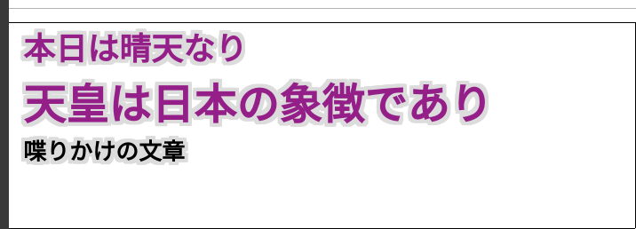

# Speech-to-Text: Jimaku System



## Setup local https server

Create `server.key` and `server.crt`

```bash
# make cert
openssl req -x509 -newkey rsa:4096 -sha256 -nodes -keyout server.key -out server.crt -subj "/CN=example.com" -days 3650
```

Make index.html page

```bash
bash ./index.sh ja-JP

# or
bash ./index.sh en-US
```

Then launch a server

```bash
# maker server
pip install click
python3 ./https_server.py -P 8080
# python3 ./https_server.py --help
```

## Open browser

Open `https://localhost:8080` with Google Chrome (not Firefox, not Chromium), and speech!
